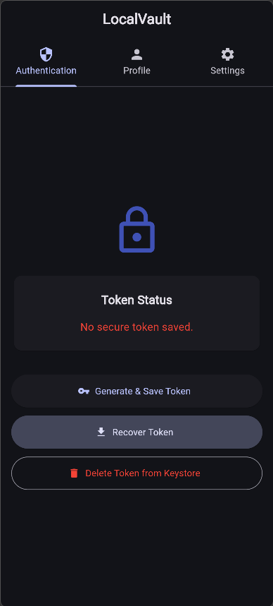

# LocalVault - Flutter App

## 🛠️ Escolhas Tecnológicas de Persistência

### 1. Por que SharedPreferences foi escolhido para as configurações?

O `SharedPreferences` foi escolhido por ser uma solução extremamente leve e nativa para guardar dados primitivos no formato chave-valor (como booleanos e strings). Como as configurações visuais (modo escuro, idioma e ativação de notificações) são dados simples e não sensíveis, o SharedPreferences oferece a performance ideal para leitura instantânea logo ao abrir o aplicativo, sem a necessidade de inicializar um banco de dados complexo.

---

### 2. Por que Hive foi escolhido para o perfil do usuário?

O `Hive` é um banco de dados NoSQL local focado em alta performance. Foi escolhido para o perfil do usuário porque permite armazenar e organizar objetos estruturados e complexos (a classe `UserProfile`) de forma rápida, utilizando o `TypeAdapter`. Ele lida perfeitamente com listas e modelos customizados (como datas e inteiros associados a strings), superando o SharedPreferences em robustez, mas sem a sobrecarga e o boilerplate exigidos por bancos de dados relacionais como o SQLite.

---

### 3. Por que flutter_secure_storage foi escolhido para o token?

Tokens de autenticação são dados altamente sensíveis. O `flutter_secure_storage` foi escolhido porque não guarda a informação em texto puro. Em vez disso, ele utiliza os mecanismos de criptografia nativos do sistema operacional (`Keychain` no iOS e `Keystore` no Android) para criptografar e proteger as chaves. Se guardássemos o token no SharedPreferences, qualquer usuário com acesso root ou aos arquivos do aplicativo poderia roubar as credenciais.

---

## ⚖️ Reflexão sobre a LGPD

> *"Se este app fosse publicado na Play Store, quais dados ele estaria coletando e armazenando? Como garantir que o usuário está ciente disso e pode excluir seus dados?"*

Atualmente, o aplicativo coleta e armazena localmente os seguintes dados:

- Nome completo
- Endereço de e-mail
- Data de cadastro
- Pontuação de engajamento
- Token de autenticação gerado
- Preferências de uso (idioma, tema e notificações)

Como a arquitetura deste projeto não possui um servidor backend (nuvem), nenhum desses dados sai do dispositivo do usuário. Tudo fica armazenado na memória local do smartphone.

Para garantir a total conformidade com a **Lei Geral de Proteção de Dados (LGPD)**:

- **Princípio da Transparência e Minimização:** Logo no primeiro acesso (onboarding), seria exibida uma Política de Privacidade clara e um Termo de Consentimento, informando ao usuário que os dados são processados apenas localmente e que coletamos estritamente o necessário para o funcionamento do app.

- **Direito ao Esquecimento:** Para cumprir as normas de exclusão, foi disponibilizado de forma transparente o botão **"Apagar Perfil (Direito ao Esquecimento)"** na interface. Essa funcionalidade aciona o comando de exclusão da Box do Hive, removendo as informações pessoais definitivamente do dispositivo de forma simples e acessível.

---

## 📸 Print do Projeto



---

## 🚀 Instruções para Rodar o Projeto

### 1. Clonar o repositório

```bash
git clone git@github.com:drypzz/localvault-flutter.git
cd localvault-flutter
```

### 2. Instalar as dependências

```bash
flutter pub get
```

### 3. Regerar os TypeAdapters (caso necessário)

```bash
flutter pub run build_runner build --delete-conflicting-outputs
```

### 4. Executar o projeto

```bash
flutter run
```

---

> by drypzz